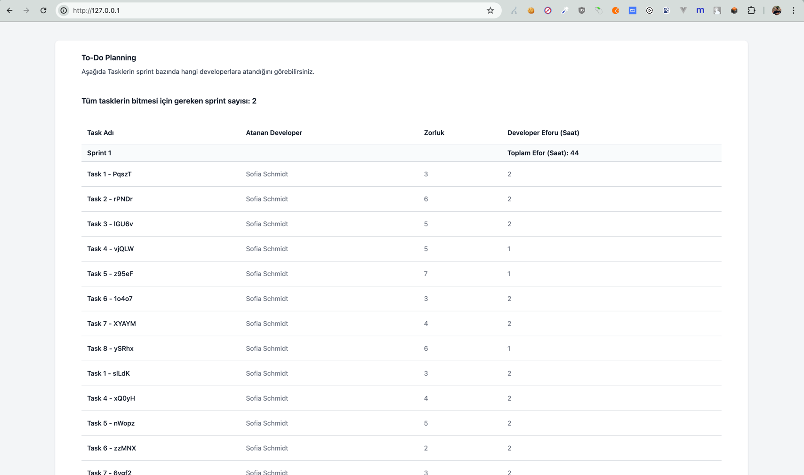

# Todo Planning Case

## Introduction



## Requirements
- PHP 8.2
- Composer

## Installation

- Copy example env file
```bash
cp .env.example .env
```

- Install dependencies
```bash
composer install
```

- Run the application
```bash
vendor/bin/sail up -d
```

- Run the migrations (Just one developer will be created. Developer Diffuculty Level will spesified as randomly (range 1-5))
```bash
vendor/bin/sail artisan migrate --seed
```

- Run the commands
```bash
# Import the work list from providers (mock-one, mock-two)
vendor/bin/sail artisan app:todo-work-list-importer-command

# Assign tasks to developers
vendor/bin/sail artisan app:assign-tasks-to-developers-command
```

- Now, you can access and check the page from http://127.0.0.1/

